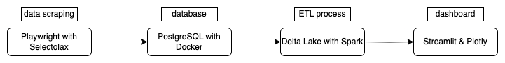
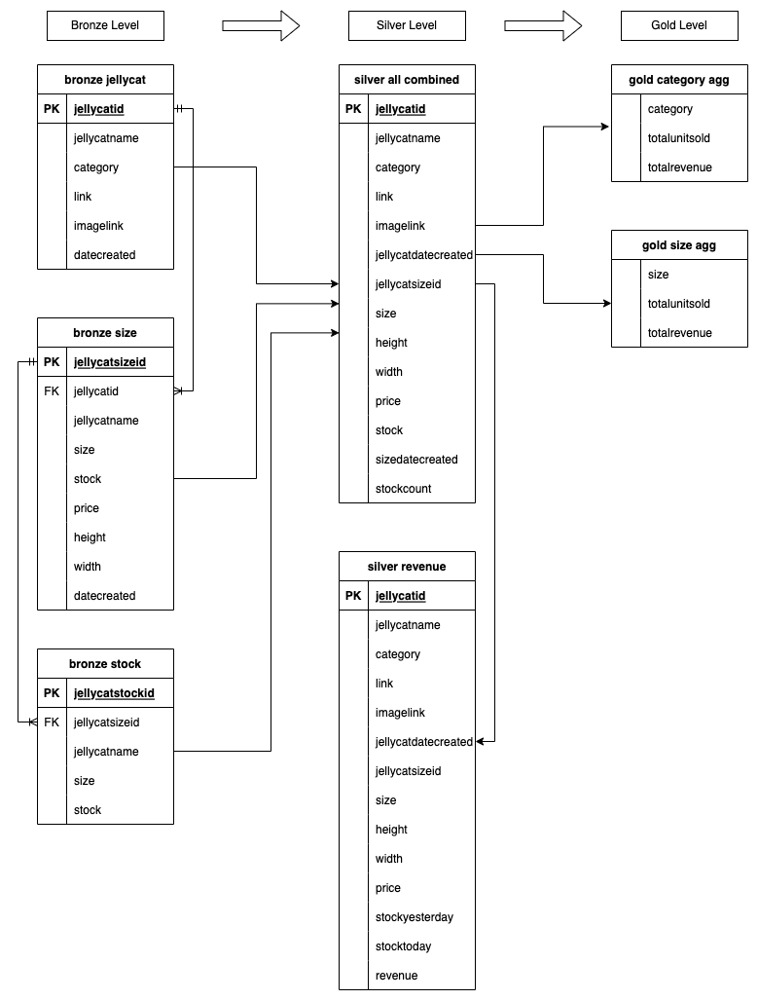

<h1 align="center">Jellycat Project</h1>

## Description
Jellycat Project is an end-to-end automated data pipeline project from web scraping, ETL, to data analysis, and dashboard. The goal of this project is to create an interactive and comprehensive dashboard to keep track of daily price & stock, product information, and various analysis of Jellycat products with the combination of different technologies, demonstrating the integration of data scraping, data pipeline and data analytics into real-life solution.
## Jellycat Dashboard (https://project-jellycat.streamlit.app/)

## Data Architecture
Here is a flowchart of the data architecture. Various applications and platforms are implemented to create an end-to-end pipeline, from data collection to data visualization. \

\
Here are some applications used in the project:
* **Playwright (web scraping)**: 
    * Cross-Browser Automation: automate browser actions across different browsers, ensuring consistent behavior
    * Headless Mode: You can run Playwright in headless mode for faster execution, suitable for server-side and CI/CD environments
* **PostgreSQL in Docker (Database to store scraped data)**:
    * ACID Compliance: ensuring data integrity
    * Extensibility: supports a wide range of data types and indexing options
    * Isolation: Docker containers provide a lightweight and isolated environment for running applications, reducing potential conflicts and dependencies, as well as avoiding excessive consumption of resources from the host system
* **Delta Lake with Spark(ETL pipeline)**:
    * Integration with Apache Spark: leverage Spark's speed and performance, scalability, and fault tolerance through resilient distributed datasets (RDDs), providing ACID transactions
    * Time Travel: Access/revert to earlier versions of data for audits, rollbacks, or reproduce
    * Change Data Capture/Feed (CDC): tracks row-level changes between versions for all the data written into tables, which includes row data along with metadata whether the specified row was inserted, deleted, or updated
* **Streamlit with Plotly (Dashboard and visualization)**:
    * Data Integration: Streamlit seamlessly integrates with popular data science libraries like Pandas, NumPy, and Matplotlib, enabling you to incorporate data analysis and visualization directly into your app
    * Interactive Data Apps: easily turn your data analysis scripts into interactive web applications without the need for extensive web development knowledge
    * Simple Scripting: create interactive web applications using just a few lines of Python code, enabling rapid development and prototyping
* **Crontab & Shell Scripting (Daily scraping & ETL automation)**:
    * Flexible Scheduling: provides flexible scheduling options, allowing you to run your data scraping job daily, weekly, or at any desired frequency

## Data Schema
Medallion Architecture is used in data pipeline to perform increamentally improving structure to ensure the quality of data going through layers. The achitecture starts with Bronze (raw integration), to Silver (filtered, cleaned, augmented) and finally ends with Gold (business-level aggregates).

## Data Scraping
Scraping is performed using Playwright and Selectolax for browsing control and html parsing. Scraping process started by scraping all jellycats from mainpage. Sizes are scraped by collecting all the sizes for each Jellycat products. Stocks are scraped from jellycats with available stocks. Scraping process is performed in headless mode (running in background). \
Here are some examples of scraping process for mainpage and sizes (Browser automations are shown for demonstrating purpose only and daily scraping will be done in headless mode). \
\

